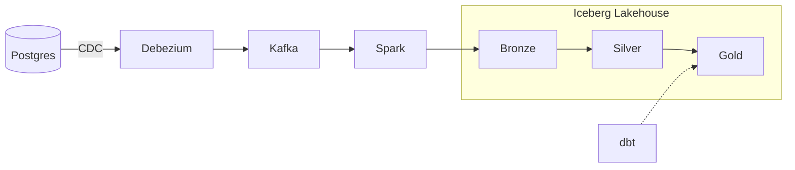

# Aaditya Singh

---

### At a glance

- 🏦 **6 years** building data platforms for **CitiBank, UBS, Oldwest Bank,** and **Commonwealth Bank of Australia**
- 👥 **Team lead** at Synechron, delivering a Bronze/Silver/Gold medallion lakehouse on a streaming CDC stack
- ☁️ **AWS Certified Data Engineer, Associate**
- 🎓 **MS Data Science** @ Northeastern (Khoury College) · TA for DS 5110

### The pattern I build

### Tech stack

| | |
|---|---|
| **Languages** |   |
| **Streaming & CDC** |   |
| **Processing** |   |
| **Storage** |   |
| **Cloud** |  |
| **Web** |  |

### Featured projects

| Project | What it does | Stack |
|---|---|---|
| [**streaming-lakehouse**](https://github.com/aaditya2504/streaming-lakehouse) | End-to-end streaming lakehouse pipeline | `Python` |
| **Job discovery automation** | Scores job listings against a resume with the Claude API, with hard filters and dedup. Workday portal watcher pushes alerts via ntfy.sh | `Python` `Claude API` |
| **ShowPass** | Event ticketing platform | `Django` |
| **BRFSS risk classification** | Imbalanced classification on ~400K survey respondents: logistic regression vs. random forest vs. XGBoost | `Python` `XGBoost` |

### Experience

| Company | Role | Clients | Years |
|---|---|---|---|
| **Synechron** | Data Engineer, Team Lead | Commonwealth Bank of Australia | 2024 - 2025 |
| **Empaxis Data Management** | Data Engineer | CitiBank, UBS, Oldwest Bank | 2019 - 2024 |

### Currently

- 🔨 Building **streaming-lakehouse** and **ShowPass**
- 🔍 Looking for **Summer 2027 data engineering co-ops** (open to relocating anywhere in the US)
