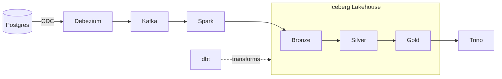

# Aaditya Kumar Singh

📫 **singh.aadit@northeastern.edu**

---

### At a glance

- 🏦 **5+ years** building ETL/ELT pipelines and data models for **CitiBank** and **Commonwealth Bank of Australia**
- ⚡ **500K+ records/day** processed · **40% faster** queries · **99.5% pipeline uptime** SLA
- 👥 Led engineering teams of **5 and 6**, and mentored **10+** junior engineers
- ☁️ **AWS Certified Data Engineer, Associate**
- 🎓 **MS Data Science** @ Northeastern (GPA 4.0) · TA for Essentials of Data Science

### Flagship build: streaming CDC lakehouse

### Tech stack

| | |
|---|---|
| **Languages** |       |
| **Streaming & CDC** |   |
| **Processing & Orchestration** |     |
| **Lakehouse & Query** |    |
| **Databases & Warehouses** |       |
| **Cloud & DevOps** | -232F3E?style=flat-square&logo=amazonwebservices&logoColor=white)     |
| **Analytics & ML** |      |

### Featured projects

| Project | What it does | Stack |
|---|---|---|
| [**Streaming Lakehouse**](https://github.com/aaditya2504/streaming-lakehouse) | Low-latency CDC lakehouse across 6 services, with a 3-layer medallion architecture managed in dbt for auditable, reproducible transformations | `Postgres` `Debezium` `Kafka` `Spark` `Iceberg` `Trino` `dbt` |
| [**Mental Health Social Determinants**](https://github.com/aaditya2504/brfss-mental-health-analysis) | Survey-weighted analysis of 200K+ BRFSS 2024 respondents across 33 states. Found loneliness is the strongest modifiable predictor of poor mental health days | `R` `survey` `R Markdown` |

| **Restaurant Analytics Platform** | Normalized MySQL database on Aiven Cloud with ACID transactions and concurrency testing, daily Airflow batch ETL, and a 5-table star-schema warehouse with OLAP queries | `MySQL` `Python` `Airflow` `R` |
| **Job Discovery Automation** | Scores job listings against a resume with the Claude API, with hard filters and dedup. Workday portal watcher pushes alerts via ntfy.sh | `Python` `Claude API` |

### Experience

| Company | Role | Client | Years |
|---|---|---|---|
| **Synechron** | Senior Data Management Analyst (Acting Team Lead) | Commonwealth Bank of Australia | 2023 - 2025 |
| **Empaxis Data Management** | Team Lead / ETL Developer | CitiBank | 2019 - 2023 |
| **Northeastern University** | Teaching Assistant, Essentials of Data Science | Khoury College | 2026 - Present |

### Currently

- 🔨 Building **Streaming Lakehouse** and **ShowPass**, a Django event ticketing platform
- 🔍 Seeking a **data engineering co-op, January to June 2027**
